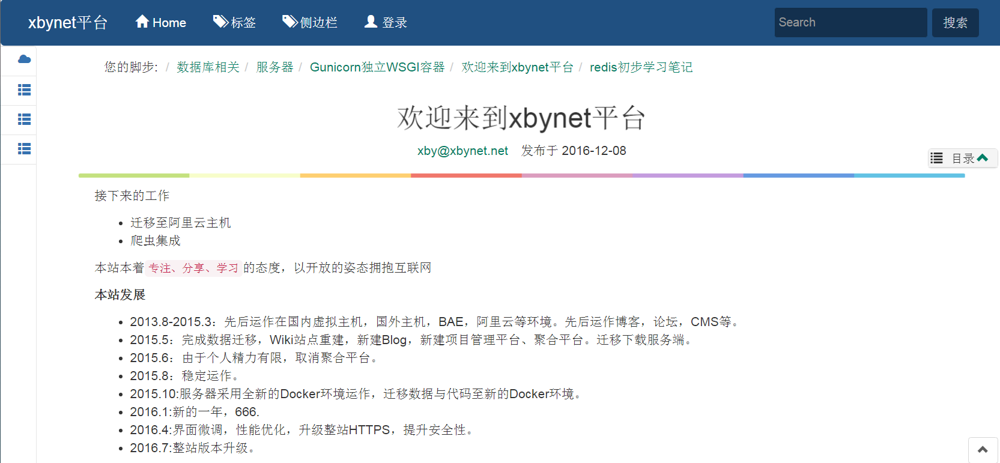

# mdwiki
markdown wiki by python with flask 

采用Python+Flask+Redis+SQLite开发（看后面选型介绍）

# 功能特性：

首先它的定位是一款wiki系统，旨在作为个人或小团队的知识库管理系统。

- markdown编辑器支持图片粘贴与拖拽上传,支持实时预览。
- wiki检索
- 图片管理
- 备份管理
- 标签
- 文章编辑定时独占锁定
- IP、session两层登录次数等限制及登录验证码。
- 通过fabric支持自动化分发部署
- 不开放注册，仅限个人或小团体使用。
- 提供dokuwiki to markdown转换脚本
- 其他

# 安装
目前仅支持python3

    pip install -r requirements.txt
    
    python run.py create_db
    
    python run.py init_admin 
    
    python run.py run

如果你想在正式环境中部署，请参考conf目录下的相关配置文件。
如果你想进行二次开发，那么你需要安装node.js

    npm init
    #replace gulp-version-number of node-modules with conf/
    gulp-version-number
    gulp dev
    gulp watch

# 使用

- 新建页面 /pages/<your_page_name>
- 侧边栏模式 # /pages/db:数据库:cloud 分别代表链接，名称，图标

# 目前尚待完善的地方：

- 不支持主题化
- 不支持插件化
- 图片管理没有进行分类
- 菜单不支持自定义
- 没有集成爬虫功能
- 性能与缓存需要进行优化
- 代码将在后续大版本中重构

# 技术选型
----
Python3 or 2.7？

作为新手，Python3义不容辞.为什么？就为了原生支持UTF-8.(开玩笑),因为Python3代表了Python的未来，而且越来越多的库已经迁移到了Python3，没有什么理由不选择它。

IDE选择：

pycharm+sublime text3，这个也没必要解释了。

Web框架选择:

Flask(为什么？只会这个，而且大家都说好。)

服务器选择:

nginx+gunicorn这应该是比较流行的方案吧，也不做过多解释。

数据库选择：
SQLite+Redis

部署方式:

- Supervisor管理Nginx+gunicorn
- Fabric远程发布

浏览器兼容性：
不考虑万恶的IE

后端库选择:

- Flask Web框架
- Jinja2 flask官方指定模板引擎
- SQLAlchemy ORM框架
- Celery任务调度
- whoosh+jieba:信息检索
- oss2：阿里云oss云存储SDK
- redis-py：Redis的python连接客户端
- Markdown：后端markdown解析
- pillow:验证码生成

Flask插件如下：

- Flask-Babel国际化插件
- Flask-Script命令行插件
- Flask-sqlalchemy ORM插件集成
- Flask-migrate数据迁移插件
- Flask-WTF表单插件
- flask-login插件
- flask-Principal权限管理
- Flask-Security插件
- flask-mail插件
- Flask-cache缓存插件
- flask-testing测试插件
- Flask-Moment本地化时间日期

前端库选择：

gulp-前端资源管理与打包,可以参考我的一篇文章:[gulp组织小型项目小记][1]

- animate.css特效
- bootstrap 都懂的
- jQuery
- jQuery插件：validate,fancyBox,jQuery-ui
- simplemde markdown编辑器
- webuploader 百度开源的文件上传组件
- toastr一款漂亮的通知组件
- taggle.js 标签输入组件
- highlight.js代码高亮

  [1]: https://segmentfault.com/a/1190000007613571

# 关于作者

[专栏地址](https://segmentfault.com/blog/xbynet)

email：xbynet@outlook.com